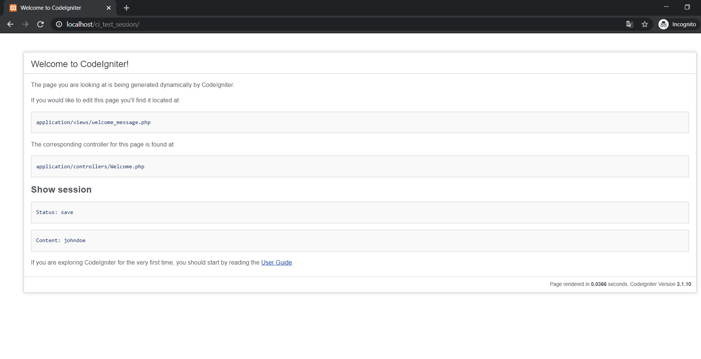

###################
CodeIgniter Test save session
###################

# crete  

<br/><br/>

# read  
  


# Config in 
application/config/config.php  
https://codeigniter.com/userguide3/libraries/sessions.html

Database basic is

```mysql
SET NAMES utf8;
SET time_zone = '+00:00';
SET foreign_key_checks = 0;
SET sql_mode = 'NO_AUTO_VALUE_ON_ZERO';

DROP TABLE IF EXISTS `ci_sessions`;
CREATE TABLE `ci_sessions` (
  `id` varchar(128) NOT NULL,
  `ip_address` varchar(45) NOT NULL,
  `timestamp` int(10) unsigned NOT NULL DEFAULT '0',
  `data` blob NOT NULL,
  PRIMARY KEY (`id`)
) ENGINE=InnoDB DEFAULT CHARSET=latin1;
```
